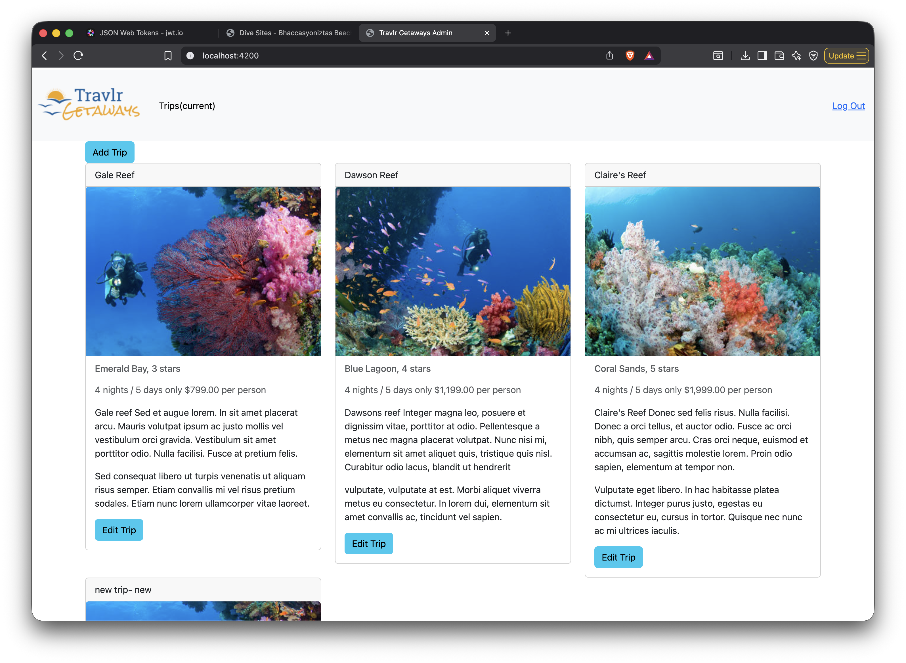

# SNHU-CS465
Contains my final project for the term(Mean Stack application)

## Functionality and Purpose
This project adds MEAN stack functionality to a static webpage. Users can view and manage data through Angular, with MongoDB storing data and Node.js/Express handling the backend.
- [Full-Stack MEAN Guide (SNHU)](https://learn.snhu.edu/d2l/lor/viewer/viewFile.d2lfile/2074342/24341,-1/)

## Preview 👀





## To get a local copy up and running follow these steps 🏃💨 

### Installation Steps
- Clone or download this repository
[here](https://github.com/JWiggins973/SNHU-CS465/archive/refs/heads/module7.zip)

- Install backend dependencies
```bash
npm install
```

# Navigate to the the Angular client and install dependencies
```bash  
npm install
```
# Start backend server
```bash
npm start
```

# Start Angular application
```bash
npm serve
```

# Open a browser and navigate to
- Single page app: [http://localhost:4200](http://localhost:4200)  
- Travlr site: [http://localhost:3000](http://localhost:3000)

## Tools (HyperLink to download) 🛠️
- [MongoDB](https://www.mongodb.com/) – NoSQL database for storing application data  
- [Express.js](https://expressjs.com/) – backend web framework  
- [Angular](https://angular.io/) – frontend framework  
- [Node.js](https://nodejs.org/) – JavaScript runtime environment  
- [Postman](https://www.postman.com/) – API testing and debugging 

  

## Additional Resources 📚	
- [Mongoose](https://mongoosejs.com/) – schema-based MongoDB object modeling
- [RESTful APIs](https://restfulapi.net/) – structured client–server communication
- [Angular Services](https://angular.io/guide/architecture-services) – frontend data handling

## Journal 📝

### **Architecture**

* Compare and contrast the types of frontend development you used in your full stack project, including Express HTML, JavaScript, and the single-page application (SPA).
* Why did the backend use a NoSQL MongoDB database?

### **Functionality**

* How is JSON different from Javascript and how does JSON tie together the frontend and backend development pieces?
* Provide instances in the full stack process when you refactored code to improve functionality and efficiencies, and name the benefits that come from reusable user interface (UI) components.

### **Testing**

* Methods for request and retrieval necessitate various types of API testing of endpoints, in addition to the difficulties of testing with added layers of security. Explain your understanding of methods, endpoints, and security in a full stack application.

### **Reflection**

* How has this course helped you in reaching your professional goals? What skills have you learned, developed, or mastered in this course to help you become a more marketable candidate in your career field?
